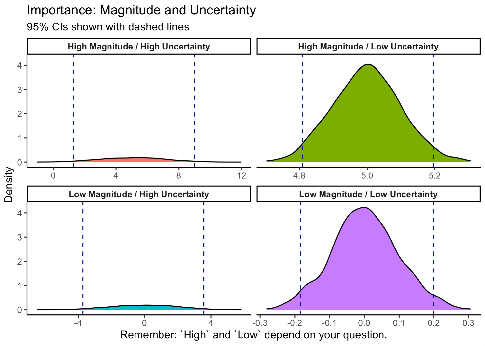

```{r setup, include=FALSE}
knitr::opts_chunk$set(echo = FALSE)
library(PPBDS.data)
library(knitr)
library(gt)
library(rstanarm)
library(tidyverse)
library(tidymodels)

# We will be using the `shaming` tibble from PPBDS.data. Check out ?shaming for
# details. On Day 1, we will explore the data and review the basics of Bayesian
# modeling, as covered in chapters 7 -- 9. On Day 2, we will decide on a model
# to use. On Day 3, we will use that model to answer questions.

# The full shaming data is huge. We will learn more about how to work with such
# large data sets next semester in Gov 1005: Big Data. Join us! For now, let's
# sample 10,000 rows and work with that.

set.seed(1005)
week_11 <- shaming %>% 
  sample_n(10000)
```

## Scene 1

**Prompt:** Let's explore the data. You can never look at your data too much!

1) How many voters got which treatments and how many voted in the 2006 primary? 
```{r}
week_11 %>%
  group_by(treatment) %>%
  summarize(n())

# Civic Duty	1097			
# Hawthorne	1117			
# Control	5517			
# Self	1160			
# Neighbors	1109

week_11 %>%
  summarize(sum(primary_06))

#3118

table(week_11$primary_06)

```


2) Explore `birth_year`. Does it make sense? If we got handed a new data set for today, would `birth_year` mean the same thing? Might we want to transform it into something different so that our model would "work" with today's data?

```{r}
# This column makes sense. You could chose to transform this column into age.

week_11 <-
  week_11 %>%
  mutate(age = 2006 - birth_year)
```


3) There are a bunch of voting records. What do they mean? Are they all recorded in the same way? How are they connected to each other? Do we want to use them all?

```{r}
# They are not recorded in the same way. If I wanted to work with all of them, I would have to change how it is encoded. We want to work with primarily week 6.
```


4) Explore the `no_of_names` variable? How is it distributed? What does it mean? Can we use it in our modeling?

```{r}
#It displays the neighbors voting records. They are all around 21. Only for neighbors group.
```


5) Check out `hh_size`. What does it mean? Is the distribution sensible? Might it be a good idea to create a new variable which is more likely to capture an effect of interest? For example, I bet that that there is a big difference between living by yourself and living with other people. I bet that there is much less difference between living with 3 versus 4 people.

```{r}
#household size, you could change it to a varible that says if you live alone
```


6) Are the factor levels for treatment convenient? Try a simple regression and see! How can we change them?

Perform other exploratory data analysis.  What other variables are connected to voting? What other variables are suspect/concerning?

```{r}
stan_glm(primary_06 ~ treatment, refresh = 0, data = week_11)

week_11 <- weel_11 %>%
  mutate(treatment = fct_revelevel(treatment, "Control"))

# Reorder it so that you control group becomes your intercept 
```


7) Create a new data set, `week_11_clean`, which makes whatever corrections/improvements you think are a good idea. We will use that data set for the next two Scenes.

```{r}
week_11_clean <- week_11 %>% 
  mutate(age = 2006 - birth_year) %>% 
  mutate(treatment = fct_relevel(treatment, "Control")) %>% 
  mutate(solo = ifelse(hh_size == 1, TRUE, FALSE)) %>% 
  select(-general_04, -no_of_names, -birth_year, -hh_size)

```


## Scene 2

**Prompt:** Having cleaned up our data, we are now ready to start modeling. 

* Let's be disciplined. Split up the data and only use the training data for the rest of today. 

```{r}
week_11_split <- initial_split(week_11_clean, prob = 0.80)
week_11_train <- training(week_11_split)
week_11_test  <- testing(week_11_split)

```


* Use stan_glm() to estimate a model of `primary_06` as a function of `treatment`. Write a sentence or two interpreting the important parameters. (Hint: Try it both with and without an intercept.)

```{r}
fit <- stan_glm(primary_06 ~ treatment,
                data = week_11_train,
                refresh = 0)


fit_intercept <- stan_glm(primary_06 ~ treatment -1,
                data = week_11_train,
                refresh = 0)

print(fit, digits = 5)
# predicted change from control to new group
print(fit_intercept, digits = 5)
# overall turnout, no comparison

```


* Use the value of MAD_SD to discuss the magnitude/importance of various coefficients. Refer to this image, courtesy of Tyler.

```{r, echo=FALSE}

```

* What is the causal effect?

```{r}
# change the treatment and then it can impact who is being treated
```


* What is the meaning --- in words and mathematically --- of something like `treatmentSelf`? After all, it is not a variable in our data set . . .

* Compare the model with the intercept to the one without. Are they the same? Explain.


## Scene 3

**Prompt:** Explore a variety models which explain `primary_06` as a function of the variables in our data set. Make sure to explore some interaction terms. 

* Come up with at least two models that a) you like and would be willing to defend and b) are somewhat different from one another. The two most common model types in these situations are "simple" and "full". The former includes a minimum number of variables. The latter errs on the side of variable inclusion and the creation of interaction terms.

* What does it mean if, for example, the coefficient of `treatmentNeighbors` varies across models? 
* Do things change if we start using all the data? Is there a danger in doing so?

